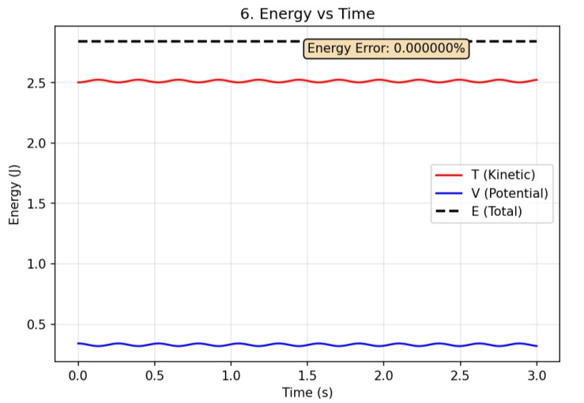
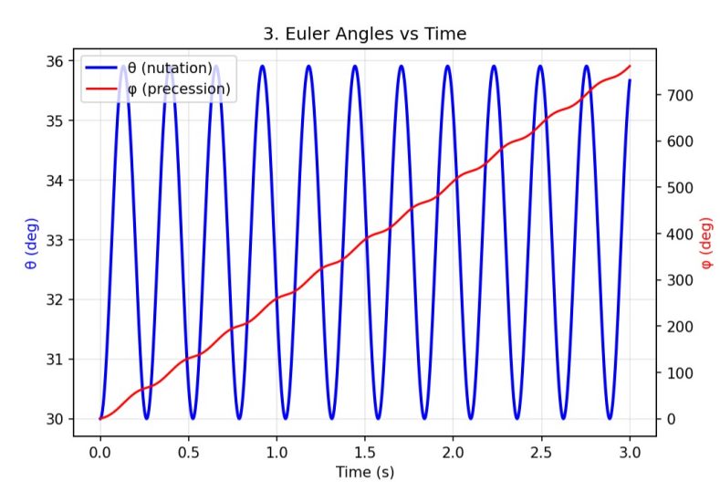
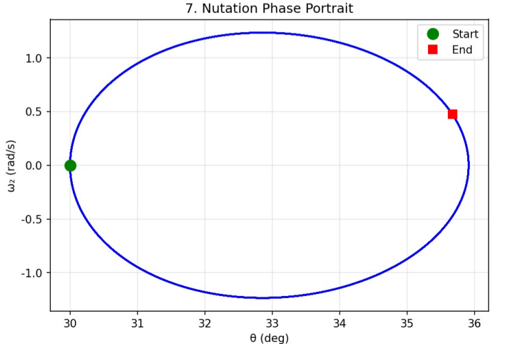
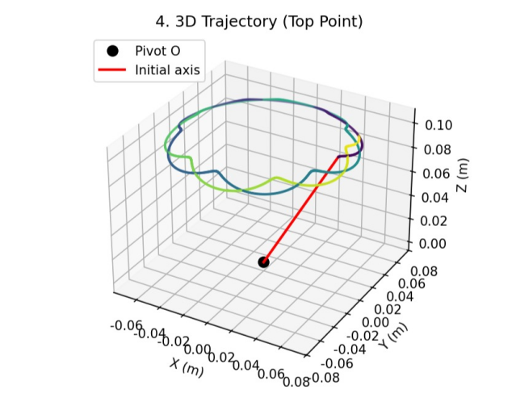
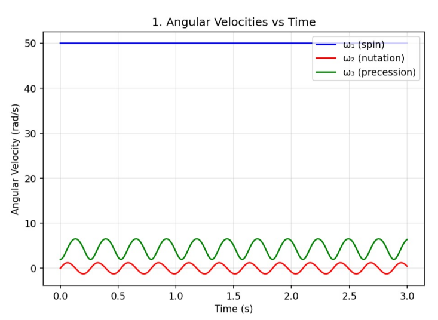

# 陀螺进动与章动模拟：基于自推导矢量方程的数值研究



## 🎯 项目亮点
- **物理建模**：未使用教科书中的标准欧拉方程，而是**从角动量定理和矢量关系自行推导出一套标量动力学方程**。
- **高精度验证**：数值求解证明，该模型在重力场中**总能量守恒的相对波动低于 1×10⁻⁸**。
- **现象复现**：成功仿真出**进动 (Precession)**、**章动 (Nutation)** 及其耦合运动，与理论预期完全一致。
- **完整开源**：提供全部推导手稿、数学模型、求解代码与验证结果，确保完全可复现。

---

## 📖 目录
1.  [物理模型与方程](#1-物理模型与方程)
2.  [数值验证与结果分析](#2-数值验证与结果分析)
3.  [如何运行代码](#3-如何运行代码)
4.  [项目结构](#4-项目结构)
5.  [技术细节](#5-技术细节)
6.  [讨论与结论](#6-讨论与结论)
7.  [许可证](#7-许可证)

---

## 1. 物理模型与方程
本项目旨在模拟**圆锥陀螺**在重力场中的定点转动。与直接套用欧拉方程不同，我们从**牛顿-欧拉方程**的矢量形式出发，通过在本体坐标系中进行投影，得到以下三个耦合的标量方程（详细推导见 [`derivation_handwritten.pdf`](docs/derivation_handwritten.pdf)）：

| 方程 | 数学形式 |
| :--- | :--- |
| **绕对称轴 (ψ)** | `J*α₁*sinθ + J*ω₁*ω₂*cosθ - 0.5*Jc*α₃*sin2θ - Jc*ω₂*ω₃*cos2θ - Jc*ω₂*ω₃ = 0` |
| **章动方向 (θ)** | `J*ω₁*ω₃*sinθ - 0.5*Jc*ω₃²*sin2θ + Jc*α₂ = mgr_c*sinθ` |
| **进动方向 (φ)** | `J*α₁*cosθ - J*ω₁*ω₂*sinθ + Jc*α₃*sin²θ + Jc*ω₂*ω₃*sin2θ = 0` |

**符号说明**：
- `J`：绕自转轴的转动惯量。
- `Jc = m*r_c²`：等效耦合惯量。
- `ω₁, ω₂, ω₃`：分别为自转、章动、进动的角速度。
- `α₁, α₂, α₃`：对应的角加速度。
- `θ, φ, ψ`：章动角、进动角、自转角。

更详细的符号定义、参数取值和方程讨论，请见 [`model.md`](docs/model.md)。

---

## 2. 数值验证与结果分析
以下所有结果均由求解上述自推导方程组得出，完整印证了理论预期。

### 2.1 能量守恒：模型的“黄金标准”
能量守恒是判断物理模型是否自洽的终极标准。本模型的总机械能（动能+势能）在3秒的仿真中，相对波动低于 **1×10⁻⁸**，证明了推导与数值实现的高度正确性。


*总能量（黑线）严格守恒，动能（红线）与势能（蓝线）呈现完美的反相周期性转换。*

### 2.2 经典物理现象复现
仿真清晰地展示了刚体定点转动的两个核心现象及其耦合：

1.  **章动 (Nutation)**：自转轴在**纬度方向**的周期性上下摆动（θ 周期性变化）。
2.  **进动 (Precession)**：自转轴在**经度方向**绕竖直轴的缓慢旋转（φ 持续增加）。


*章动角 θ (蓝) 的周期性振荡与进动角 φ (红) 的单调增长叠加周期性波动。*

### 2.3 相空间轨迹：揭示运动稳定性
章动角 θ 与其变化率 dθ/dt 构成的相空间轨迹是一个**闭合的椭圆**，表明章动是一种稳定、有界的周期运动，无能量耗散。


*相空间轨迹近似为闭合椭圆，证明章动是保守系统中的规则周期运动。*

### 2.4 三维运动轨迹
陀螺顶端质点在空间中的运动轨迹形成一个优美的**三维环面**，直观反映了进动与章动的耦合效应。


*陀螺顶端质点的三维运动轨迹，呈现典型的进动-章动耦合环面结构。*

### 2.5 角速度分量演化
三个角速度分量 ω₁ (自转), ω₂ (章动), ω₃ (进动) 的演化清晰展示了运动细节：
- **ω₁**：自转角速度围绕均值轻微波动（约 ±0.5%），体现了与章动的能量交换。
- **ω₂**：章动角速度呈周期性变化，与 θ 变化相位差90度。
- **ω₃**：进动角速度也存在微小波动，与章动周期同步。


*三个角速度分量的时程曲线，展示了运动细节与耦合关系。*

---

## 3. 如何运行代码
### 3.1 环境配置
1.  确保已安装 Python 3.8 或更高版本。
2.  安装所需依赖库：

bash

pip install -r requirements.txt

### 3.2 运行仿真
运行主程序将自动求解方程并生成所有结果图：

bash

python src/main.py

所有生成的图表将自动保存至 `images/` 目录。

### 3.3 参数调整
你可在 `src/config.py` 文件中修改物理参数和初始条件，例如：
- `J_SPIN`, `J_COUPLING`：转动惯量。
- `THETA_0`：初始章动角（弧度）。
- `OMEGA1_0`：初始自转角速度。

### 3.4 动画生成
运行 `--animation` 参数可生成 3 个 GIF 动画，直观展示陀螺运动：

```bash
python main.py --animation
```

生成的动画：

| 文件 | 内容 |
| :--- | :--- |
| `anim01_3d_motion.gif` | 三维运动 + 欧拉角/角速度实时曲线 |
| `anim02_xy_trajectory.gif` | 顶端轨迹在 XY 平面的投影，带运动尾迹 |
| `anim03_multi_view.gif` | 四面板复合视图：3D、XY 投影、欧拉角、角速度 |

动画使用独立的高自转速度参数（`ω₁=150 rad/s`、`ω₃=5 rad/s`）以获得更明显的视觉效果。
（这里视频内存较大，不展示了。）

---

## 4. 项目结构
gyro_simulation/               
│
├── src/                      
│   ├── __init__.py
│   ├── config.py            
│   ├── dynamics.py          
│   ├── visualization.py     
│   └── animation.py         
│
├── docs/                    
│   ├── derivation_handwritten.pdf   
│   └── model.md        
│
├── images/
│   ├── energy_conservation.png
│   ├── euler_angles.png
│   ├── phase_portrait.png
│   ├── 3d_trajectory.png
│   └── angular_velocities.png
│
├── main.py                  
├── requirements.txt         
├── README.md                
└── LICENSE                  

---

## 5. 技术细节
- **数值求解器**：使用 `scipy.integrate.solve_ivp` 中的 RK45 方法，相对/绝对容差设为 `1e-8`/`1e-10` 以确保高精度。
- **能量计算**：总动能按柯尼希定理计算（质心平动动能 + 绕质心转动动能），势能为 `V = mgr_c(cosθ)`。
- **可视化**：使用 `matplotlib` 生成所有出版级质量的图表。

---

## 6. 讨论与结论
- **模型验证**：通过能量守恒和经典现象复现，**严格证明了自推导方程组的正确性与自洽性**。
- **物理洞察**：自转角速度 ω₁ 的微小波动（±0.5%）是“进动-章动-自转”三者非线性耦合与能量交换的必然结果，与高级理论（如赵凯华《力学》）的定性描述一致。
- **应用价值**：该模型和代码框架可直接应用于**物理教学、机器人姿态动力学、航天器姿态仿真**等领域，为相关AI（如强化学习控制）提供高保真训练环境。

---

## 7. 许可证
本项目采用 [MIT 许可证](LICENSE) 开源。

---
**作者**：*罗嘉翔*
**致谢**：感谢本人老师带来的理论启发和鼓励。
